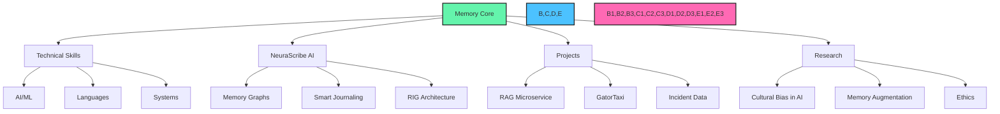

<!-- Memory Network Interface -->
<div align="center">
  
</div>

```
MEMORY SYSTEM v2.5.4 | USER: KUSHAGRA SIKKA | SYSTEM: NEURASCRIBE MEMORY NETWORK
```

<div align="center">
  <a href="https://neurascribe.ai" target="_blank"></a>
  <a href="https://github.com/KushagraSikka" target="_blank"></a>
  <a href="https://www.linkedin.com/in/kushagrasikka/" target="_blank"></a>
</div>

<!-- Neural Network Visualization -->


<!-- Memory Fragments -->
<table>
  <tr>
    <td width="50%" style="border: none;">
      <h3>🔵 RETRIEVING MEMORY: CORE IDENTITY</h3>
      <pre>
SUBJECT: Kushagra Sikka
LOCATION: Gainesville, FL
OCCUPATION: Founder, Deep Learning Researcher
FOCUS: Episodic Memory AI Systems
AFFILIATION: University of Florida (Alumnus)
      </pre>
    </td>
    <td width="50%" style="border: none;">
      <h3>🟢 ACTIVE MEMORY: NEURASCRIBE AI</h3>
      <pre>
PROJECT: Memory Companion AI
STATUS: Active Development
TECHNOLOGY: Memory Graphs, RIG Systems
GOAL: Augment Human Cognitive Abilities
URL: https://neurascribe.ai
      </pre>
    </td>
  </tr>
</table>

<!-- Code Block for Skills -->
```python
# Neural Skill Network: Kushagra Sikka
# Last updated: May 2025

class TechnicalSkills:
    ai_ml = ["PyTorch", "TensorFlow", "Transformers", "Retrieval Augmented Generation", 
             "Vector Embeddings", "LLMs", "Knowledge Graphs", "Memory Networks"]
             
    languages = ["Python", "C++", "TypeScript", "Java", "Go", "Ruby"]
    
    infrastructure = ["AWS (EC2, Lambda, SageMaker)", "Docker", "Kubernetes", 
                     "Terraform", "CI/CD", "Microservices"]
    
    def get_expertise_level(self, skill):
        expertise = {
            "Memory Systems": "Creator",
            "RAG": "Expert",
            "Neural Networks": "Expert",
            "Cloud Architecture": "Advanced"
        }
        return expertise.get(skill, "Proficient")
```

<!-- Project Showcases as Memory Instances -->
<div style="background-color: #0D1117; border-radius: 10px; padding: 15px; margin: 10px 0;">
  <h3>📂 MEMORY ACCESS: PROJECT DATA</h3>
  
  <div style="margin: 10px 0; padding: 10px; border-left: 4px solid #64F4AC;">
    <strong>RAG Microservice</strong><br/>
    Episodic memory retrieval service using vector embeddings and transformer models. Achieves 94% retrieval accuracy across multiple knowledge domains.
    <br/><a href="https://github.com/KushagraSikka/RAG_Microservice-">View Memory Instance</a>
  </div>
  
  <div style="margin: 10px 0; padding: 10px; border-left: 4px solid #4CC2FF;">
    <strong>GatorTaxi</strong><br/>
    Optimized memory allocation system using Red-Black Trees and Min-Heaps. Demonstrates O(log n) complexity for memory retrieval operations.
    <br/><a href="https://github.com/KushagraSikka/Gator_taxi_maintenance_">View Memory Instance</a>
  </div>
  
  <div style="margin: 10px 0; padding: 10px; border-left: 4px solid #FF69B4;">
    <strong>Incident Data Enrichment</strong><br/>
    Automated memory augmentation for incident reports. Enhances raw data with geospatial and temporal context.
    <br/><a href="https://github.com/KushagraSikka/Incident_Data_Enrichment_Project">View Memory Instance</a>
  </div>
</div>

<!-- The Philosophy Terminal -->
```
$ neura-core --access-philosophy

ACCESSING CORE BELIEF SYSTEM...

"The future of human cognition lies at the intersection of artificial and 
biological memory. NeuraScribe isn't building a replacement for human memory,
but an extension of it. We're creating a system that learns how YOU think and
remembers the way YOU would, becoming a seamless extension of your mind."

CONNECTION ESTABLISHED: kushagra@neurascribe.ai
```

<div align="center">
  
</div>

<!-- Neural Interface Footer -->
<div align="center">
  
  <br/>
  <code>MEMORY SYSTEM ACTIVE • NEURAL INTERFACE STABLE • END TRANSMISSION</code>
</div>
